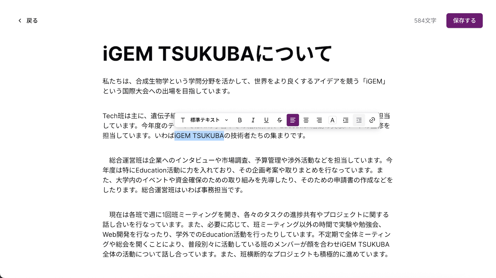
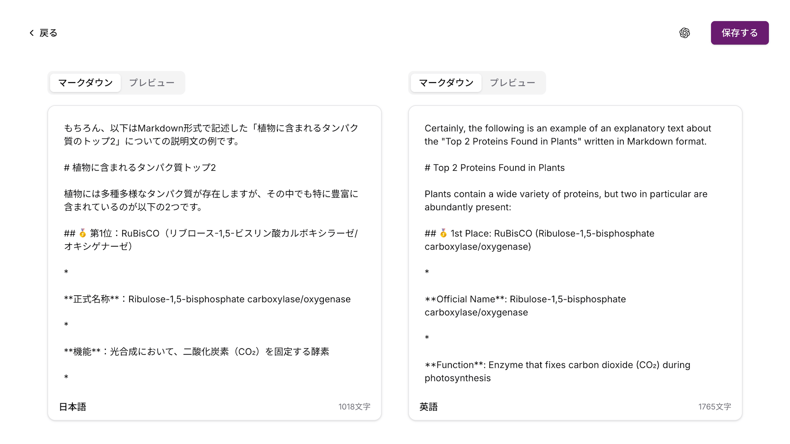
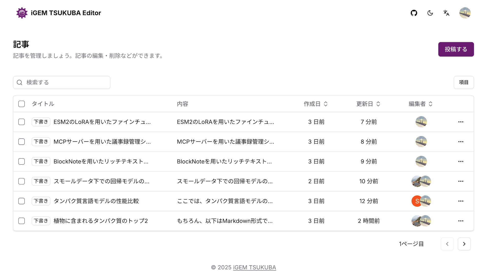
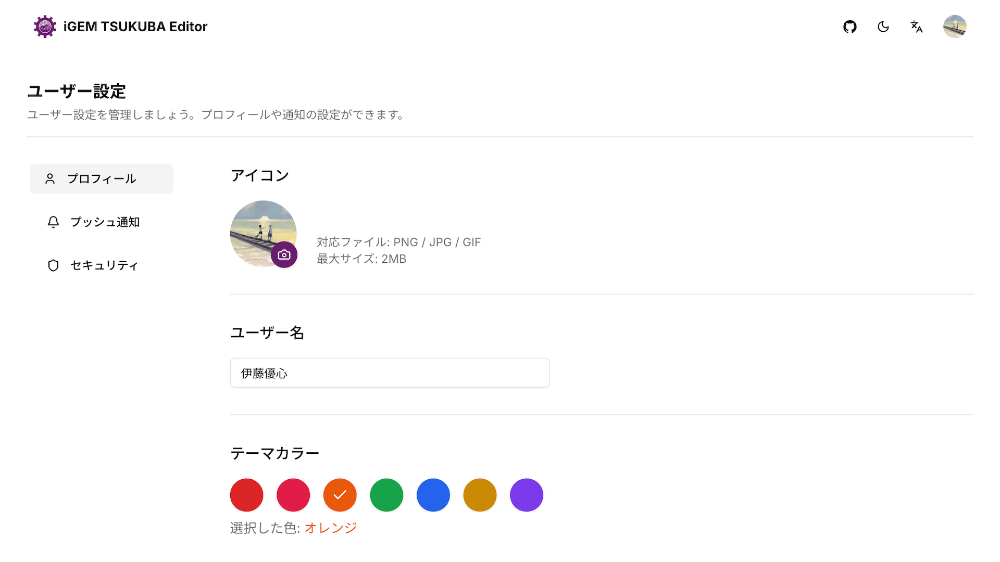
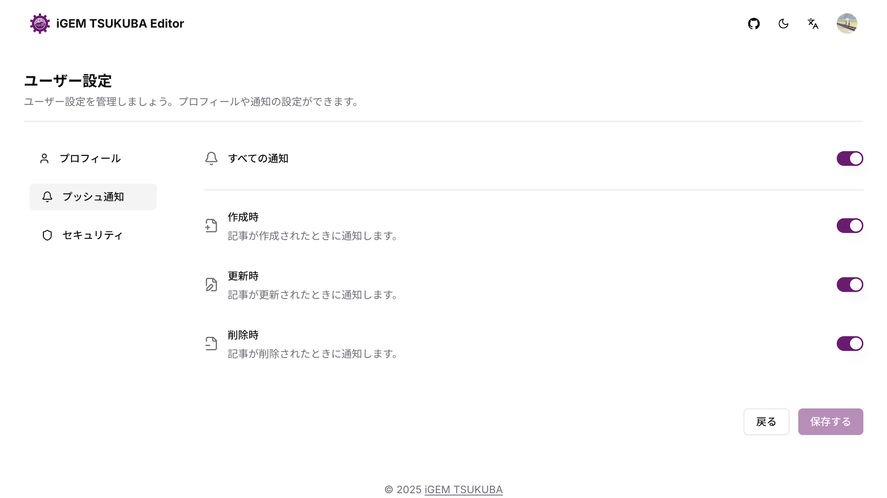

# iGEM TSUKUBA Editor

iGEM TSUKUBA Editorは、筑波大学の一般学生団体であるiGEM TSUKUBAが作成した記事を管理するツールです。

<br/>

## 📦 Overview

このプロジェクトは、Wikiに使用する記事の編集および提出をするために作成されました。
リッチテキストエディターによる記事の編集とOpen AI APIを用いた記事の翻訳を実装しています。

<br/>

## ✨ Features

### エディタ

[BlockNote](https://www.blocknotejs.org/)を使用して実装しました。また、[KaTeX](https://katex.org/)を自前で用意しています。

<picture>
  <source media="(prefers-color-scheme: dark)" srcset="./assets/editor-dark.png">
  
</picture>

<br/>

### 翻訳

[Open AI API](https://openai.com/)を用いた記事の翻訳が利用できます。また、マークダウンのプレビューを用意しています。

<picture>
  <source media="(prefers-color-scheme: dark)" srcset="./assets/translator-dark.png">
  
</picture>

<br/>

### ダッシュボード

記事を管理するためのダッシュボードです。記事の追加・削除ができます。

<picture>
  <source media="(prefers-color-scheme: dark)" srcset="./assets/dashboard-dark.png">
  
</picture>

<br/>

### プロフィール

プロフィールの設定です。 ユーザー名やアイコンを変更できます。

<picture>
  <source media="(prefers-color-scheme: dark)" srcset="./assets/profile-setting-dark.png">
  
</picture>

<br/>

### プッシュ通知

プッシュ通知の設定です。アクションごとに通知することができます。

<picture>
  <source media="(prefers-color-scheme: dark)" srcset="./assets/notification-setting-dark.png">
  
</picture>

<br/>
<br/>

## ⚡️ Structure

```
igem-tsukuba-editor/
├── actions/            # サーバーアクション
├── app/
│   ├── (auth)/         # 認証ページ
│   ├── (dashboard)/    # ダッシュボードページ
│   ├── (editor)/       # エディターページ
│   ├── (settings)/     # 設定ページ
│   ├── (top)/          # トップページ
│   ├── (translator)/   # 翻訳ページ
│   └── api/            # API
├── components/         # コンポーネント
│   └── ui/
├── config/             # アプリ設定
├── extensions/         # 拡張機能
├── hooks/              # カスタムフック
├── i18n/               # 国際化
├── lib/                # ユーティリティ
├── messages/           # 言語ファイル
├── partykit/           # PartyKit
├── prisma/             # データベーススキーマ
├── public/             # アセット
├── schemas/            # フォームスキーマ
├── styles/             # スタイル
└── types/              # 型定義
```

<br/>

## 🚀　Install

1. リポジトリをクローン

   ```bash
   git clone https://github.com/yourusername/igem-tsukuba-editor.git
   cd igem-tsukuba-editor
   ```

2. パッケージのインストール

   ```bash
   pnpm install
   ```

3. 環境変数の設定

   `.env.saple`を参考に`.env.local`を作成してください。

4. データベースのマイグレーション

   ```bash
   pnpm prisma migrate dev
   ```

5. 開発サーバーの起動

   ```bash
   pnpm dev
   ```

6. ブラウザで [http://localhost:3000](http://localhost:3000) にアクセス

<br/>

## 🤝 Contributer

<a href="https://github.com/yushin-ito">
  
</a>

<br/>

## 📜 LICENSE

[MIT LICENSE](LICENSE)
